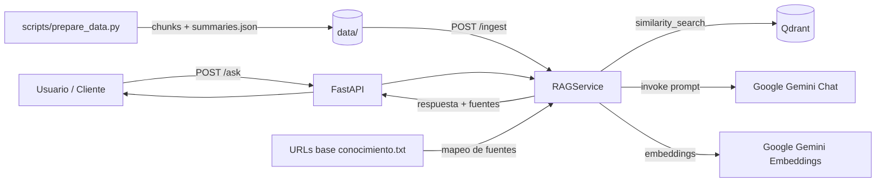

# RAG de Detección de Phishing con LangChain y Qdrant

## Tabla de contenidos

1. [Descripción general](#descripción-general)
2. [Objetivos](#objetivos)
3. [Arquitectura de alto nivel](#arquitectura-de-alto-nivel)
4. [Tecnologías utilizadas](#tecnologías-utilizadas)
5. [Estructura del proyecto](#estructura-del-proyecto)
6. [Cómo ejecutar el RAG](#cómo-ejecutar-el-rag)
7. [Cómo ejecutar los tests](#cómo-ejecutar-los-tests)
8. [Formato de respuesta del RAG](#formato-de-respuesta-del-rag)

## Descripción general

Este proyecto implementa una API RAG (Retrieval-Augmented Generation) centrada en phishing.

El sistema:
- Prepara documentos PDF extrayendo texto, dividiéndolo en chunks y generando resúmenes (`data/summaries.json`)
- Indexa los chunks en Qdrant con embeddings de Google Gemini
- Recupera contexto relevante para cada pregunta mediante búsqueda de similitud
- Genera respuestas en español usando Google Gemini Chat
- Añade siempre las fuentes al final de la respuesta

## Objetivos

- Ofrecer respuestas fiables sobre phishing basadas en conocimiento documentado
- Mantener trazabilidad de la información mediante URLs de fuente
- Exponer una API simple con FastAPI para ingesta y consulta
- Facilitar pruebas automáticas para validar comportamiento de la API y del servicio RAG

## Arquitectura de alto nivel



Flujo principal:
1. **Preparación:** PDFs → chunks de texto → `data/optimized_chunks/` + `data/summaries.json`
2. **Ingesta:** chunks → embeddings → colección Qdrant `phishing_knowledge`
3. **Consulta:** pregunta → recuperación en Qdrant → generación con LLM → respuesta con fuentes

## Tecnologías utilizadas

- Python 3.11 / 3.12
- FastAPI + Uvicorn
- LangChain (`langchain`, `langchain-community`, `langchain-google-genai`, `langchain-qdrant`)
- Qdrant (base de datos vectorial)
- Google Gemini (`gemini-2.5-flash-lite` para chat, `gemini-embedding-001` para embeddings)
- Pytest (tests unitarios e integración con mocks)
- Docker Compose (orquestación local de Qdrant)
- uv (gestión de entorno y dependencias)

## Estructura del proyecto

```text
.
├── .env.example                        # Plantilla de variables de entorno
├── .github/
│   └── workflows/                      # CI/CD: tests, lint, build y push de imagen
├── Dockerfile                          # Imagen de la API
├── docker_compose.yml                  # Orquestación local (Qdrant + API)
├── pyproject.toml                      # Dependencias y metadatos del paquete
├── pytest.ini                          # Configuración de pytest
├── uv.lock                             # Lockfile de dependencias (uv)
├── URLs base conocimiento.txt          # Mapeo de PDFs a URLs de fuente
├── qdrant_config/
│   └── config.yml                      # Configuración del servidor Qdrant
├── data/
│   ├── *.pdf                           # Documentos de conocimiento
│   ├── summaries.json                  # Resúmenes generados por prepare_data.py
│   └── optimized_chunks/              # Chunks de texto generados por prepare_data.py
├── scripts/
│   └── prepare_data.py                 # Extrae texto, genera chunks y summaries.json
├── src/
│   ├── __init__.py
│   ├── app.py                          # Aplicación FastAPI (endpoints y lifespan)
│   ├── main.py                         # Punto de entrada Uvicorn
│   └── services/
│       └── rag_service.py              # Lógica RAG: ingesta, búsqueda y generación
└── tests/
    ├── conftest.py                     # Fixtures y configuración de pytest
    └── test_rag.py                     # Tests unitarios e integración (mocks)
```

## Cómo ejecutar el RAG

### 1) Requisitos

- Docker Desktop en ejecución (para Qdrant)
- Python 3.11 o 3.12
- [`uv`](https://docs.astral.sh/uv/) instalado
- API Key de Google (`GOOGLE_API_KEY`)

### 2) Configuración

Copiar el archivo de entorno y editarlo:

```powershell
Copy-Item .env.example .env
```

Variables mínimas en `.env`:

```env
GOOGLE_API_KEY="tu_api_key"
QDRANT_URL="http://localhost:6333"
QDRANT_COLLECTION="phishing_knowledge"
DATA_DIR="data"
CHUNKS_DIR="data/optimized_chunks"
KNOWLEDGE_URLS_FILE="URLs base conocimiento.txt"
SIMILARITY_TOP_K="5"
CHUNK_SIZE="1200"
CHUNK_OVERLAP="200"
AUTO_INGEST_ON_STARTUP="false"
RECREATE_ON_STARTUP="false"
```

### 3) Instalar dependencias

```powershell
uv sync
```

### 4) Levantar Qdrant

```powershell
docker compose -f docker_compose.yml up -d qdrant
```

**Generar chunks y `summaries.json`:**

```powershell
uv run python scripts/prepare_data.py
```

### 5) Arrancar la API

```powershell
uv run python src/main.py
```

### 6) Indexar documentos (POST /ingest)

```powershell
Invoke-RestMethod -Uri http://localhost:8000/ingest -Method Post `
  -ContentType "application/json" -Body '{"recreate": true}'
```

### 7) Probar endpoints

**Health check:**

```powershell
Invoke-RestMethod http://localhost:8000/health
```

**Pregunta al RAG:**

```powershell
$body = @{ question = "Que es el phishing y como protegerse?" } | ConvertTo-Json
Invoke-RestMethod -Uri http://localhost:8000/ask -Method Post `
  -ContentType "application/json" -Body $body
```

**Equivalentes con `curl`:**

```bash
curl http://localhost:8000/health

curl -X POST http://localhost:8000/ingest \
  -H "Content-Type: application/json" -d '{"recreate": true}'

curl -X POST http://localhost:8000/ask \
  -H "Content-Type: application/json" \
  -d '{"question": "Que es el phishing y como protegerse?"}'
```

## Cómo ejecutar los tests

**Suite completa:**

```powershell
uv run pytest tests/ -v
```

**Una clase concreta:**

```powershell
uv run pytest tests/test_rag.py::TestHealthEndpoint -v
```

### Cobertura funcional

| Área | Tests |
|---|---|
| Endpoints | `/`, `/health`, `/ingest`, `/ask` |
| Modelos Pydantic | `IngestRequest`, `AskRequest` |
| Helpers | `_normalize`, `_as_bool` |
| Servicio RAG | configuración, lazy-loading de modelos |
| Integración (mock) | flujo completo de ingesta y consulta |

## Formato de respuesta del RAG

El endpoint `POST /ask` devuelve:

```json
{
  "answer": "Texto de respuesta en español...\n\nFuentes:\n- https://fuente-1\n- https://fuente-2",
  "sources": [
    "https://fuente-1",
    "https://fuente-2"
  ]
}
```

Reglas:
- `answer` incluye siempre el bloque final `Fuentes:`
- `sources` contiene la lista estructurada de URLs utilizadas
- Si no hay fuentes mapeadas en `URLs base conocimiento.txt`, se indica explícitamente
