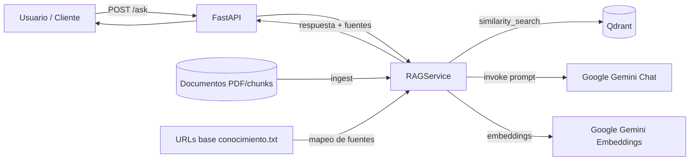

# RAG de Detección de Phishing con LangChain y Qdrant

## Tabla de contenidos

1. [Descripción general](#descripción-general)
2. [Objetivos](#objetivos)
3. [Arquitectura de alto nivel](#arquitectura-de-alto-nivel)
4. [Tecnologías utilizadas](#tecnologías-utilizadas)
5. [Estructura del proyecto](#estructura-del-proyecto)
6. [Cómo ejecutar el RAG](#cómo-ejecutar-el-rag)
7. [Cómo ejecutar los tests](#cómo-ejecutar-los-tests)
8. [Formato de respuesta del RAG](#formato-de-respuesta-del-rag)

## Descripción general

Este proyecto implementa una API RAG (Retrieval-Augmented Generation) centrada en phishing.

El sistema:
- Carga documentos de conocimiento (PDF/chunks)
- Los indexa en Qdrant con embeddings de Google Gemini
- Recupera contexto relevante para cada pregunta
- Genera respuestas en español
- Añade siempre las fuentes al final de la respuesta

## Objetivos

- Ofrecer respuestas fiables sobre phishing basadas en conocimiento documentado
- Mantener trazabilidad de la información mediante URLs de fuente
- Exponer una API simple con FastAPI para ingesta y consulta
- Facilitar pruebas automáticas para validar comportamiento de la API y del servicio RAG

## Arquitectura de alto nivel



Flujo principal:
1. Ingesta: documentos -> chunks -> embeddings -> Qdrant
2. Consulta: pregunta -> recuperación en Qdrant -> generación con LLM -> respuesta con fuentes

## Tecnologías utilizadas

- Python 3.11/3.12
- FastAPI + Uvicorn
- LangChain
- Qdrant
- Google Gemini (chat + embeddings)
- Pytest (tests unitarios e integración con mocks)
- Docker Compose (orquestación local de Qdrant)

## Estructura del proyecto

```text
.
├── .env.example
├── Dockerfile
├── docker_compose.yml
├── pyproject.toml
├── pytest.ini
├── README.md
├── URLs base conocimiento.txt
├── qdrant_config/
│   └── config.yml
├── src/
│   ├── __init__.py
│   ├── app.py
│   ├── main.py
│   └── services/
│       └── rag_service.py
└── tests/
		├── conftest.py
		└── test_rag.py
```

## Cómo ejecutar el RAG

### 1) Requisitos

- Docker Desktop en ejecución
- Python 3.11 o 3.12
- API Key de Google (GOOGLE_API_KEY)

### 2) Configuración

Copiar archivo de entorno:

```powershell
Copy-Item .env.example .env
```

Editar .env con al menos:

```env
GOOGLE_API_KEY="tu_api_key"
QDRANT_URL="http://localhost:6333"
QDRANT_COLLECTION="phishing_knowledge"
DATA_DIR="data"
CHUNKS_DIR="data/optimized_chunks"
KNOWLEDGE_URLS_FILE="URLs base conocimiento.txt"
SIMILARITY_TOP_K="5"
CHUNK_SIZE="1200"
CHUNK_OVERLAP="200"
AUTO_INGEST_ON_STARTUP="true"
RECREATE_ON_STARTUP="true"
```

### 3) Levantar Qdrant

```bash
docker compose -f docker_compose.yml up -d qdrant
```

### 4) Instalar dependencias

```bash
uv sync
```

### 5) Arrancar API

```bash
uv run python -m uvicorn src.app:app --host 0.0.0.0 --port 8000
```

### 6) Probar endpoints

Health:

```bash
curl http://localhost:8000/health
```

Ingesta:

```bash
curl -X POST http://localhost:8000/ingest -H "Content-Type: application/json" -d '{"recreate": true}'
```

Pregunta al RAG:

```bash
curl -X POST http://localhost:8000/ask -H "Content-Type: application/json" -d '{"question": "Que es el phishing y como protegerse?"}'
```

## Cómo ejecutar los tests

### Ejecutar toda la suite

```bash
uv run pytest tests/ -v
```

### Ejecutar una clase concreta

```bash
uv run pytest tests/test_rag.py::TestHealthEndpoint -v
```

### Cobertura funcional actual

- Endpoints: /, /health, /ingest, /ask
- Modelos de entrada: IngestRequest, AskRequest
- Helpers: _normalize, _as_bool
- Servicio RAG: configuración y carga de modelos
- Integración (con mocks): flujo de ingesta y consulta

## Formato de respuesta del RAG

El endpoint POST /ask devuelve un JSON con este formato:

```json
{
	"answer": "Texto de respuesta en español...\n\nFuentes:\n- https://fuente-1\n- https://fuente-2",
	"sources": [
		"https://fuente-1",
		"https://fuente-2"
	]
}
```

Reglas clave:
- answer siempre incluye el bloque final Fuentes:
- sources contiene la lista estructurada de URLs utilizadas
- Si no hay fuentes mapeadas, se indica explícitamente en el bloque de fuentes
